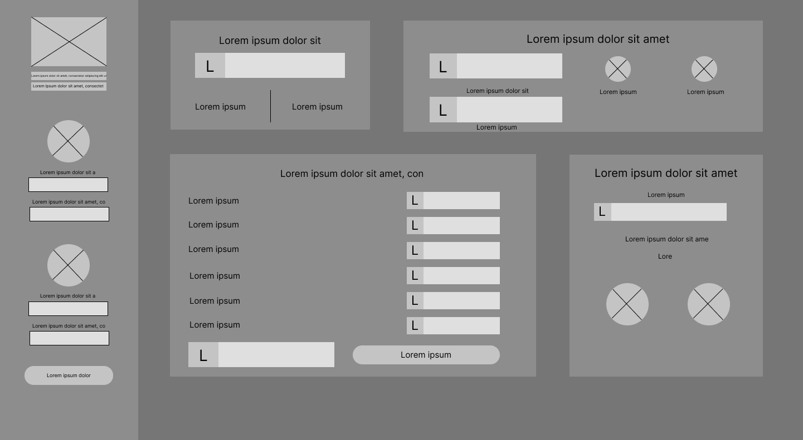
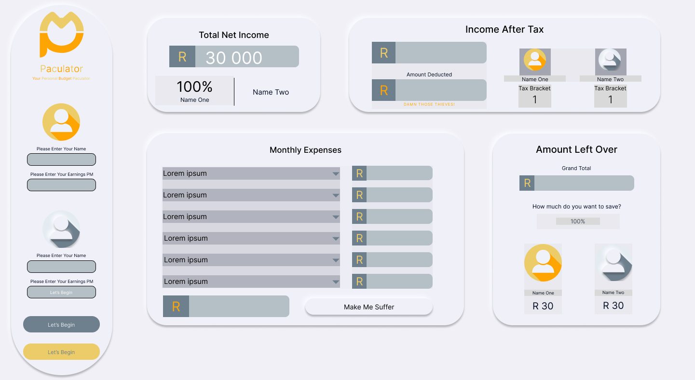
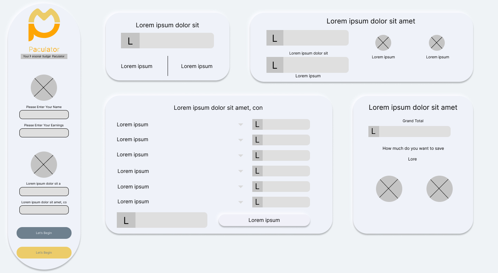
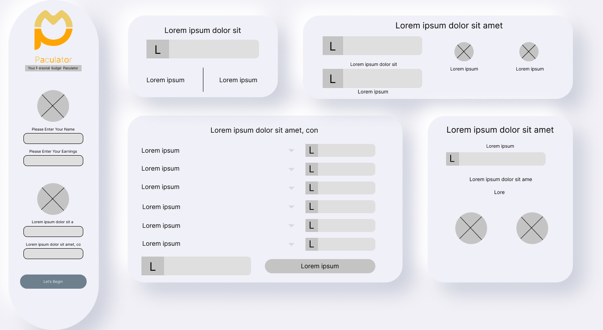

<!-- Repository Information & Links-->
<br />


<!--  -->


<!-- HEADER SECTION -->
<h5 align="center" style="padding:0;margin:0;">Tsebo Ramonyalioa</h5>
<h5 align="center" style="padding:0;margin:0;">200200</h5>
<h6 align="center">DV202 - Term 2 | 2022</h6>
<h6 align="center">Unit Testing</h6>
</br>
<p align="center">

  <a href="https://github.com/Tsebo200/paculate">
    
  </a>
  
  <h3 align="center">Paculator</h3>

  <p align="center">
    A react project to manage breadwinners earnings while unit testing all the functions<br>
    
   <br />
   <br />
   <a href="https://drive.google.com/file/d/1BT_I1xlJTMef2u1XfV93AzrsM9vlIC_y/view?usp=sharing">View Demo</a>
    ·
    <a href="https://github.com/Tsebo200/paculate/issues">Report Bug</a>
    ·
    <a href="https://github.com/Tsebo200/paculate/issues">Request Feature</a>
</p>
<!-- TABLE OF CONTENTS -->

## Table of Contents

* [About the Project](#about-the-project)
  * [Project Description](#project-description)
  * [Built With](#built-with)
* [Getting Started](#getting-started)
  * [Prerequisites](#prerequisites)
  * [How to install](#how-to-install)
* [Features and Functionality](#features-and-functionality)
* [Concept Process](#concept-process)
   * [Ideation](#ideation)
   * [Wireframes](#wireframes)
   * [Custom UI](#user-flow)
* [Development Process](#development-process)
   * [Implementation Process](#implementation-process)
        * [Highlights](#highlights)
        * [Challenges](#challenges)
   * [Future Implementation](#peer-reviews)
* [Final Outcome](#final-outcome)
    * [Mockups](#mockups)
    * [Video Demonstration](#video-demonstration)
* [Conclusion](#conclusion)
* [License](#license)
* [Contact](#contact)
* [Acknowledgements](#acknowledgements)

<!--PROJECT DESCRIPTION-->


### Project Description

My Project is a budget calculator, that calculates breadwinners earnings. The breadwinner can manage their taxes, monthly expenses as well as their savings. 

### Built With

* [React](https://reactjs.org/)
* [React Testing Library](https://testing-library.com/docs/react-testing-library/intro/)


<!-- GETTING STARTED -->
<!-- Make sure to add appropriate information about what prerequesite technologies the user would need and also the steps to install your project on their own machines -->
## Getting Started

The following instructions will get you a copy of the project up and running on your local machine for development and testing purposes.

### Prerequisites

Ensure that you have the latest version of [NPM](https://www.npmjs.com/) installed on your machine. The [GitHub Desktop](https://desktop.github.com/) program will also be required. 

### How to install

### Installation
Here are a couple of ways to clone this repo:

1. GitHub Desktop </br>
Enter `https://github.com/Tsebo200/paculate.git` into the URL field and press the `Clone` button.

2. Clone Repository </br>
Run the following in the command-line to clone the project:
   ```sh
   git clone https://github.com/Tsebo200/paculate.git
   ```
    Open `Software` and select `File | Open...` from the menu. Select cloned directory and press `Open` button

3. Install Dependencies </br>
Run the following in the command-line to install all the required dependencies:
   ```sh
   npm install
   ```

<!-- FEATURES AND FUNCTIONALITY-->
<!-- You can add the links to all of your imagery at the bottom of the file as references -->
## Features and Functionality

<!-- note how you can use your gitHub link. Just make a path to your assets folder -->


### All The Latest Anime Data! 

Using the Jikan API, I have collected and collated all the most relevant Anime data into once seemless react experience!


### Feature 1

This dropdown dynamically loads the data of the selected anime in the charts.


### Feature 2

The functionality of the information pills and anime poster updates randomly every session. 


<!-- CONCEPT PROCESS -->
<!-- Briefly explain your concept ideation process -->
<!-- here you will add things like wireframing, data structure planning, anything that shows your process. You need to include images-->
## Concept Process

The `Conceptual Process` is the set of actions, activities and research that was done when starting this project. As part of my conceptual process I have sketched wireframes in Figma, I looked at Pinterest for inspiration. I planned out the data structure for my project in a word processor.

### Ideation


<br>
![image6][image6]

### Wireframes


<br>


<br>


<br>




### Custom UI


<!-- DEVELOPMENT PROCESS -->
## Development Process

The `Development Process` is the technical implementations and functionality done in the frontend and backend of the application. 
In my frontend I implemented a Google Font called Nunito, a box shadow on my info pills (in Home Page) as well as my graph containers (in the comparison page), I added Hover States for my info pills, my navigational buttons and my logo.
In my backend I utilised React js including the react hooks such as useState, useRef and useEffect. I used the useEffect to retrieve all the anime when the page renders, useRef was used to store a variable (the selectedAnime) and the useState was used to change the anime name when it was selected in the dropdown. I utilised axios to make an HTTP request for my API (this allows me to fetch data from the API easily). I implemented charts js to create dynamic charts.

### Implementation Process
<!-- stipulate all of the functionality you included in the project -->
<!-- This is your time to shine, explain the technical nuances of your project, how did you achieve the final outcome!-->

* Utilized React `Charts.JS` dependency for Data visualization
* Implemented Routing with `React-Router v6`.
* API End Point: https://api.jikan.moe/v4/anime.
* Used React Hooks to write less code

#### Highlights
<!-- stipulated the highlight you experienced with the project -->
* I enjoyed this brief as it forces you to be  creative in presenting your data with charts js. I learnt about React and React hooks. 
* I mostly enjoyed the API implementation with Charts js, I found it satisfying when the data was loading through the charts.

#### Challenges
<!-- stipulated the challenges you faced with the project and why you think you faced it or how you think you'll solve it (if not solved) -->
* When the anime shows the an anime movie in the home page, the API does not have information about the year and the season it was released (this leaving the last two info pills empty), thus, I would make an if statement that removes the last two pills if an anime movie loads. 


#### Above And Beyond

What aspects of this final build contribute to the `Above And Beyond` Component of your brief?
<!-- what did you learn outside of the classroom and implement into your project-->
* Debugging
* Debugging is the process in which a developer fixes the bug (issue) that is in the code in order to make the website/application work as intended.
* I installed a plugin called React Developer Tool, it adds React code in my console from the Browser Router to the components on that page.

### Future Implementation
<!-- stipulate functionality and improvements that can be implemented in the future. -->

* I should have been able to push the data from my API into the line graph, thus I will find a way to do so.
* I will work better at my frontend to make it more pleasing.

<!-- MOCKUPS -->
## Final Outcome

### Mockups


<br>


<!-- VIDEO DEMONSTRATION -->
### Video Demonstration

To see a run through of the application, click below:

[View Demonstration](https://drive.google.com/file/d/1eUNqAr9TJ-ScsZEJzURRuIjhyxq4sL8S/view?usp=sharing)


See the [open issues](https://github.com/Tsebo200/paculate/issues) for a list of proposed features (and known issues).

<!-- AUTHORS -->
## Authors

* **Tsebo Ramonyalioa** - [Tsebo200](https://github.com/Tsebo200)

<!-- LICENSE -->
## License

Distributed under the MIT License. See `LICENSE` for more information.\

<!-- LICENSE -->
## Contact

* **Tsebo Ramonyalioa** - [email@address](mailto:200200@virtualwidnow.co.za) - [@instagram_handle](https://www.instagram.com/inspiration200200/) 
* **Project Link** - https://github.com/Tsebo200/paculate

<!-- ACKNOWLEDGEMENTS -->

<!-- all resources that you used and Acknowledgements here -->


